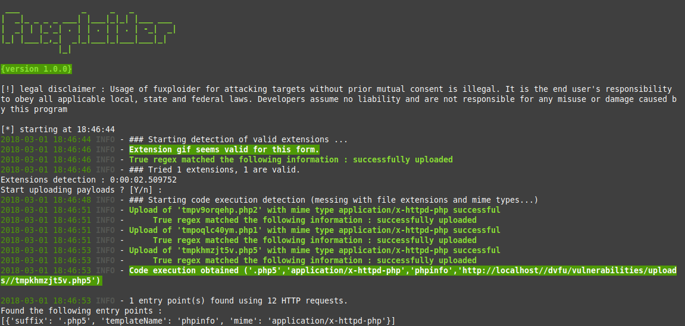

# smartycyber

[](https://www.python.org/) [](https://raw.githubusercontent.com/S-amarty/smartycyber/master/LICENSE.md)

# smartycyber

[](https://www.python.org/) [](https://raw.githubusercontent.com/S-amarty/smartycyber/master/LICENSE.md)

**smartycyber** is an open-source penetration testing tool designed to automate the process of detecting and exploiting file upload form vulnerabilities. It helps identify which file types are allowed, determines the best technique for uploading web shells or malicious payloads, and checks whether uploaded files are scanned by a vulnerability scanner or not.

## Screenshots
----


## Installation
----

_You will need Python 3.6 or higher._

```bash
git clone https://github.com/S-amarty/smartycyber.git
cd smartycyber
pip3 install -r requirements.txt


## Screenshots
----


## Installation
----

_You will need Python 3.6 or higher._

```bash
git clone https://github.com/S-amarty/smartycyber.git
cd smartycyber
pip3 install -r requirements.txt


If pip causes issues (especially on Windows):

bash
Copy code
# Build the Docker image
docker build -t smartycyber .

python3 -m pip install -r requirements.txt

# Build the Docker image
docker build -t smartycyber .

python3 smartycyber.py -h

⚠️ Legal Disclaimer:
Usage of smartycyber for attacking targets without prior mutual consent is illegal. It is the end user's responsibility to comply with all applicable local, state, and federal laws.
Designed by Smarty — @s.amarty
Developers assume no liability and are not responsible for any misuse or damage caused by this program.